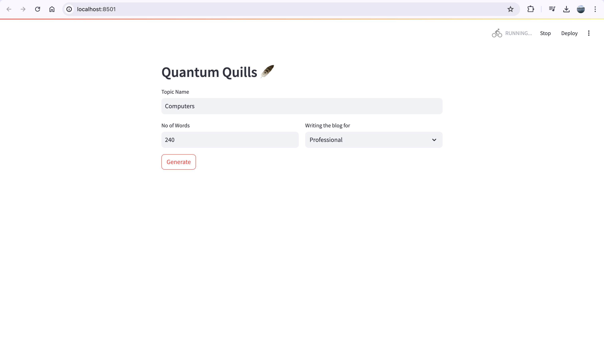

# Llama-2-7B-GGML-Powered Blog Generator

Using the advanced Llama 2 7B Chat model by Meta, this project offers a seamless experience for generating high-quality blogs with just a few clicks.

## Features

- **AI-Powered Blog Generation**: Utilize the Llama 2 7B Chat model to generate compelling blog content.
- **Customizable Writing Styles**: Choose from various writing styles including Fun, General, and Professional.
- **Word Count Specification**: Define the number of words for each blog post.
- **User-Friendly Interface**: Interact easily through a Streamlit-based web interface.

## Prerequisites

Before you begin, ensure you have met the following requirements:
- Python 3.8 or higher
- Streamlit
- langchain
- langchain_community
- ctransformers

## Installation

To set up the project locally, follow these steps:

1. **Create a Virtual Environment**:
    ```bash
    python -m venv venv
    source venv/bin/activate  # On Windows use `venv\Scripts\activate`
    ```

2. **Install Dependencies**:
    ```bash
    pip install -r requirements.txt
    ```

3. **Download the Llama 2 7B Chat Model**:
    Ensure the model file `llama-2-7b-chat.ggmlv3.q8_0.bin` is downloaded and placed in the appropriate directory.

## Usage

To start the application:

1. **Run the Streamlit App**:
    ```bash
    streamlit run app.py
    ```

2. **Access the Web Interface**
    

3. **Generate Blog Content**:
    - Enter the topic name.
    - Specify the number of words.
    - Select the writing style (Fun, General, Professional).
    - Click on "Generate" to produce the blog post.

## Contributing

We welcome contributions! If you would like to contribute, please fork the repository and create a pull request. For significant changes, consider opening an issue to discuss your ideas.

## License

This project is licensed under the MIT License. See the [LICENSE](LICENSE) file for details.

## Acknowledgements

We extend our gratitude to:
- Meta for the Llama 2 model.
- The developers of `streamlit`, `langchain`, `langchain_community`, and `ctransformers`.


